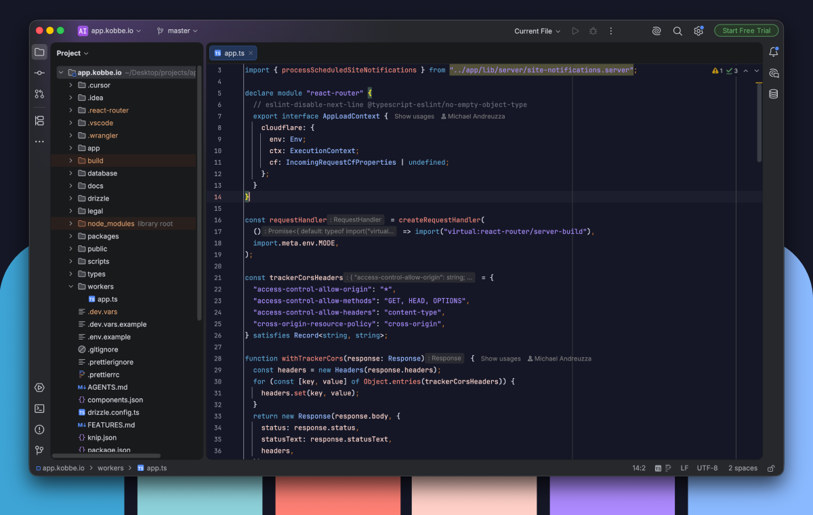
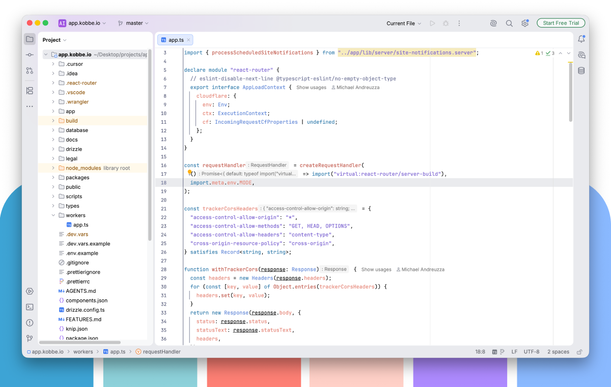
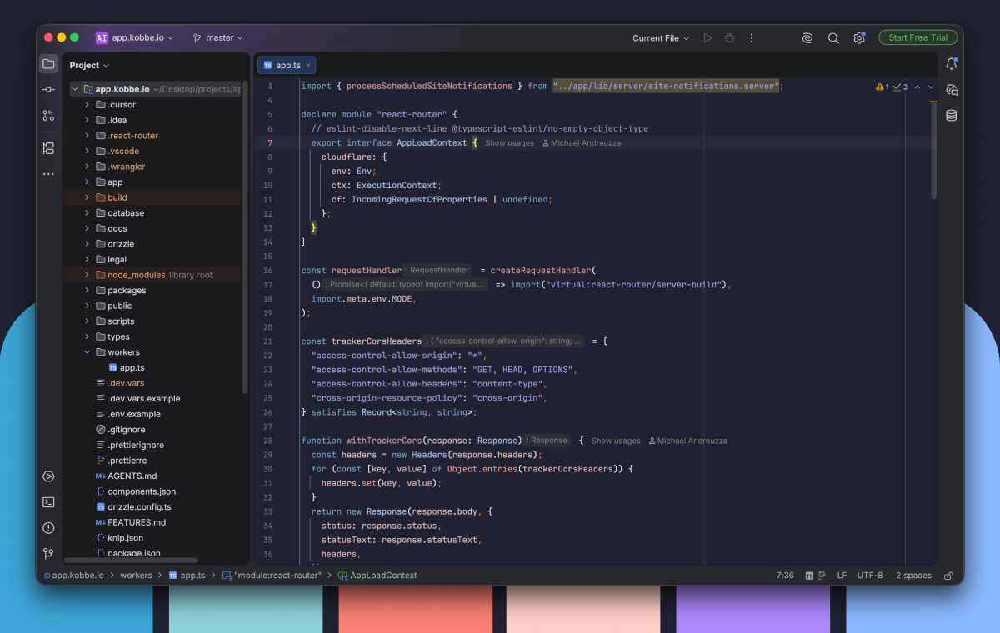

# Serendipity for JetBrains

Elegant, minimal, and clean color palette for your tools.

See other interfaces at the [official website](https://www.michaelandreuzza.com/vscode/serendipity/).

## Preview

| Serendipity Midnight | Serendipity Morning | Serendipity Sunset |
| --- | --- | --- |
|  |  |  |

## Available themes

- **Midnight** — dark
- **Morning** — light
- **Sunset** — dark

## Installation

Install from JetBrains Marketplace (see `MARKETPLACE.md`) or import `.icls` files manually (see `INSTALL.md`).

See `MARKETPLACE.md` for publishing and release steps.

## Created by

[Micheal Andreuzza](https://github.com/michael-andreuzza)
